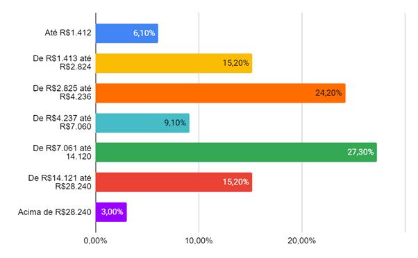
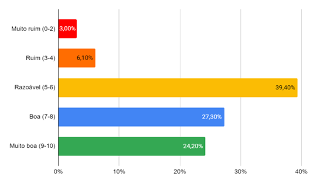
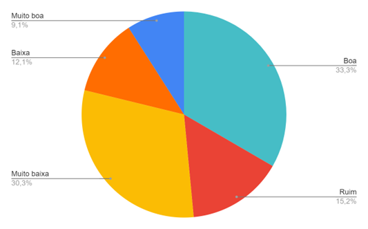
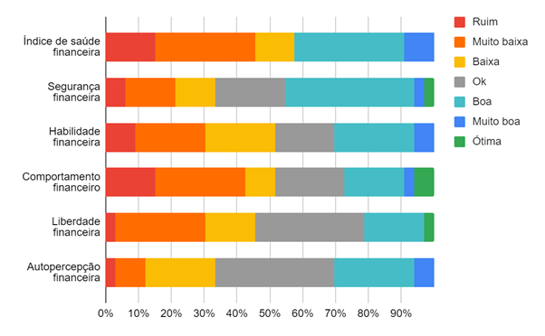

# Introdução

As dificuldades financeiras enfrentadas por grande parte da população brasileira são um tema central nas pesquisas e debates sobre economia e bem-estar social no país. Em junho de 2024, o Mapa da Inadimplência da Serasa Experian (2024) revelou que 43,99% dos adultos brasileiros estavam inadimplentes, evidenciando um aumento significativo na taxa de inadimplência. Esse dado reflete o impacto contínuo de fatores econômicos adversos, como o aumento do custo de vida, o desemprego elevado e as altas taxas de juros, que têm dificultado o cumprimento dos compromissos financeiros por grande parte da população.

Paralelamente, o relatório da Federação Brasileira de Bancos (FEBRABAN) em cooperação técnica com o Banco Central do Brasil (2023b) sobre o Índice de Saúde Financeira do Brasileiro (I-SFB), oferece uma análise abrangente das finanças das famílias brasileiras. O documento destaca a crescente preocupação com o endividamento, indicando que uma parcela significativa da população está enfrentando dificuldades financeiras, evidenciadas pelo aumento das dívidas e pela inadimplência. O uso inadequado do crédito, exacerbado pelo aumento do custo de vida e pela instabilidade econômica são questões recorrentes. Além disso, a falta de educação financeira dificulta o planejamento e contribui para decisões financeiras inadequadas.

As consequências do endividamento e da falta de educação financeira incluem não apenas o impacto negativo na qualidade de vida, mas também um efeito adverso sobre a saúde mental e emocional dos indivíduos. O ciclo de endividamento pode resultar em dificuldades para manter pagamentos em dia e na incapacidade de planejar o futuro financeiro de forma eficaz.

Diante desse contexto, uma solução eficaz seria o desenvolvimento de uma plataforma digital de controle de despesas e dicas financeiras, projetada para ajudar os usuários a gerenciar melhor suas finanças pessoais, reduzir o endividamento e promover uma maior estabilidade financeira.

## Problema
O problema a ser abordado por este projeto trata do mau gerenciamento financeiro feito por jovens e adultos, como consequência da falta de educação financeira vivenciada por grande parte da população brasileira, somada ao falso poder de compra gerado por cartões de crédito e semelhantes.

Como resultado dessa dificuldade de organizar e administrar as próprias finanças, até mesmo por desconhecer práticas saudáveis de economia, podem ocorrer gastos por impulso, situações de inadimplência e endividamento público, dificultando a criação de planos a longo prazo por não conseguir economizar.

## Objetivos

O objetivo geral deste projeto é o desenvolvimento de uma aplicação web de fácil acesso e manuseio pelo usuário, de modo que seja mais intuitiva e didática, que possibilite compreender e aplicar conceitos básicos de gestão financeira pessoal e/ou familiar, instigando a curiosidade e a importância de adquirir saúde financeira em diferentes cenários socioeconômicos.

Pode-se frisar os seguintes objetivos específicos:
* Criar planejamento financeiro;
* Estabelecer metas financeiras;
* Fornecer dicas e recomendações;
* Disponibilizar recursos educativos;
* Manter controles de orçamentos, gastos e receitas.

## Justificativa

Segundo pesquisa realizada para construção e validação do I-SFB, pela FEBRABAN e Banco Central do Brasil (2021, p. 20):

>"Saúde financeira pode ser determinada como a extensão com que um indivíduo: avalia ser capaz de cumprir suas obrigações financeiras correntes; entende ser capaz de tomar boas decisões financeiras; tem disciplina e autocontrole para cumprir objetivos; sente-se seguro quanto ao futuro financeiro; tem liberdade de fazer escolhas que permitam aproveitar a vida."

Assim, podemos assumir que a saúde financeira é um aspecto crucial do bem-estar dos indivíduos, influenciando diretamente sua qualidade de vida e capacidade de realizar objetivos de curto, médio e longo prazo. A educação financeira exerce um papel fundamental na autonomia dos indivíduos para que tomem decisões conscientes e responsáveis sobre finanças pessoais. Em pesquisa realizada pelo Serasa Experian (2024), 72.50 milhões de brasileiros se encontravam inadimplentes e, destes dados, 29.16% das dívidas vêm de bancos e cartões de crédito. 

O segmento bancário, em especial de cartões de crédito, se destaca como o principal fator contribuinte para esse cenário. Sugerir soluções direcionadas a renegociações de dívidas e, a educação financeira pode ser essencial para reduzir esses índices. Portanto, este projeto justifica-se pela necessidade de desenvolver estratégias que auxiliem na reestruturação financeira dos brasileiros, promovendo uma recuperação econômica sustentável e a melhoria da qualidade de vida da população.

## Público-Alvo

Para melhor caracterização do público-alvo, inicialmente estabelecido por um critério amplo de ter idade igual ou maior a 18 anos, foi utilizado um questionário por meio da plataforma Microsoft Forms. O questionário foi composto por três seções: (1) dados sociodemográficos; (2) dados socioeconômicos; e (3) Índice de Saúde Financeira dos Brasileiros (I-SFB), desenvolvido e amplamente validado pelas instituições FEBRABAN e Banco Central do Brasil (2021) e disponibilizado abertamente por estes para uso e aplicação (2023a). Foram coletados dados de 33 pessoas que responderam ao questionário aplicado. Apresentou-se uma porcentagem semelhante de mulheres (45%) e homens (52%), além de uma pessoa de gênero não-binário (3%). Com base nos dados obtidos, o público-alvo desta aplicação seria predominantemente composto por adultos com idades entre 18 e 40 anos (93.9% dos respondentes), que podem estar tanto em uma fase de consolidação financeira quanto em um cenário estável financeiramente. 

Conforme representado no gráfico 1, foi identificada uma variabilidade significativa da renda dos participantes, sendo que predominou a faixa de R$7.061 a R$14.120 (27.3%), seguida por R$2.825 a R$4.236 (24.2%). O grupo pesquisado é caracterizado por uma alta taxa de emprego, com 85% dos entrevistados atualmente trabalhando. A maioria possui um comportamento de consumo digital, evidenciado pela preferência por compras online em comparação com as compras presenciais. Em relação ao uso de recursos financeiros, destaca-se o uso frequente de cartões de crédito, com 60.6% dos participantes utilizando-os regularmente, enquanto o parcelamento de compras é menos comum, com 15.2% fazendo uso intenso desse recurso.

<figure>
   
  <figurecaption>Gráfico 1 - Renda familiar mensal dos participantes</figurecaption>
</figure>

Os dados indicam que muitos desses indivíduos enfrentam desafios na gestão de suas finanças, sendo a impulsividade, a falta de conhecimento, despesas essenciais elevadas, falta de hábito de realizar controle financeiro e imprevistos os principais fatores dificultadores relatados. Os principais objetivos financeiros apontados pelos respondentes incluem fazer uma reserva financeira, independência financeira, economizar para atingir um objetivo pessoal, liberdade para gastar com lazer sem se comprometer, e investir. Como indicado no gráfico 2, a maior parte considera que tem uma saúde financeira razoável (39.4%), mas há um interesse significativo em ferramentas que auxiliem na construção de uma poupança e no planejamento financeiro. O perfil revela uma necessidade clara por uma aplicação que seja intuitiva e simples, com visualização unificada da vida financeira, e que ofereça funcionalidades para registrar e controlar despesas, categorizar gastos de forma fácil, permitir a projeção financeira, estabelecer e acompanhar metas, fornecer orientações sobre como gerenciar as finanças, além de incluir notificações sobre contas a pagar, metas e limites pré-definidos.

<figure>
   
  <figurecaption>Gráfico 2 - Autoavaliação de saúde financeira</figurecaption>
</figure>

O I-SFB mede a saúde financeira por meio de um questionário pontuado em uma escala de 0 a 100, e classifica a pontuação em sete níveis de saúde financeira (ótima, muito boa, boa, ok, baixa, muito baixa e ruim). Além de avaliar a saúde financeira de forma geral, também avalia cinco dimensões financeiras: segurança, liberdade, habilidade, comportamento e autopercepção. As informações obtidas por meio do I-SFB mostram que 27.3% das pessoas apresentaram gastos maiores do que a renda no último ano, 60.6% consideram que as despesas são motivos de estresse na casa e 51.5% se encontram em uma situação de aperto financeiro. A média de saúde financeira dos participantes da pesquisa foi de 51,42, classificada como baixa. Apesar disso, a maior parte das pessoas se enquadrou na classificação “boa” (33.3%), seguida, porém, por “muito baixa” (30.3%). Os gráficos 3 e 4 apresentam a porcentagem de pessoas em cada nível de saúde financeira no índice geral e por dimensões, respectivamente.

<figure>
   
  <figurecaption>Gráfico 3 - Classificação do nível de saúde financeira geral</figurecaption>
</figure>

<figure>
   
  <figurecaption>Gráfico 4 - Comparação do nível de saúde financeira de acordo com as dimensões</figurecaption>
</figure>

