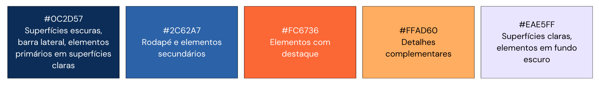
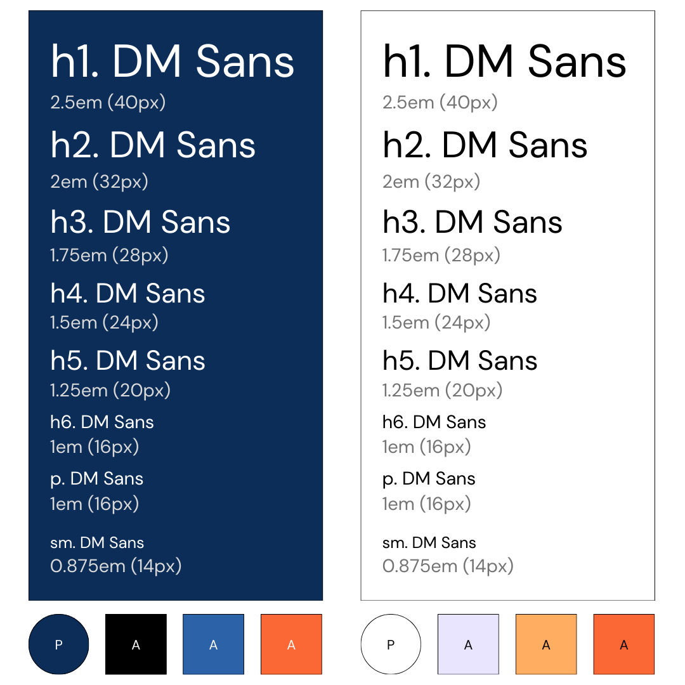
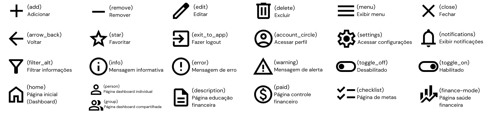
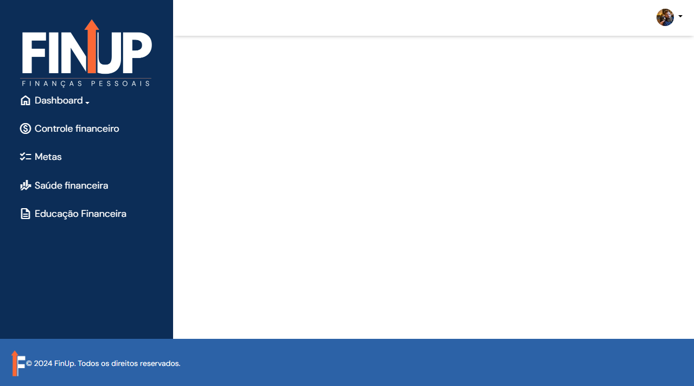
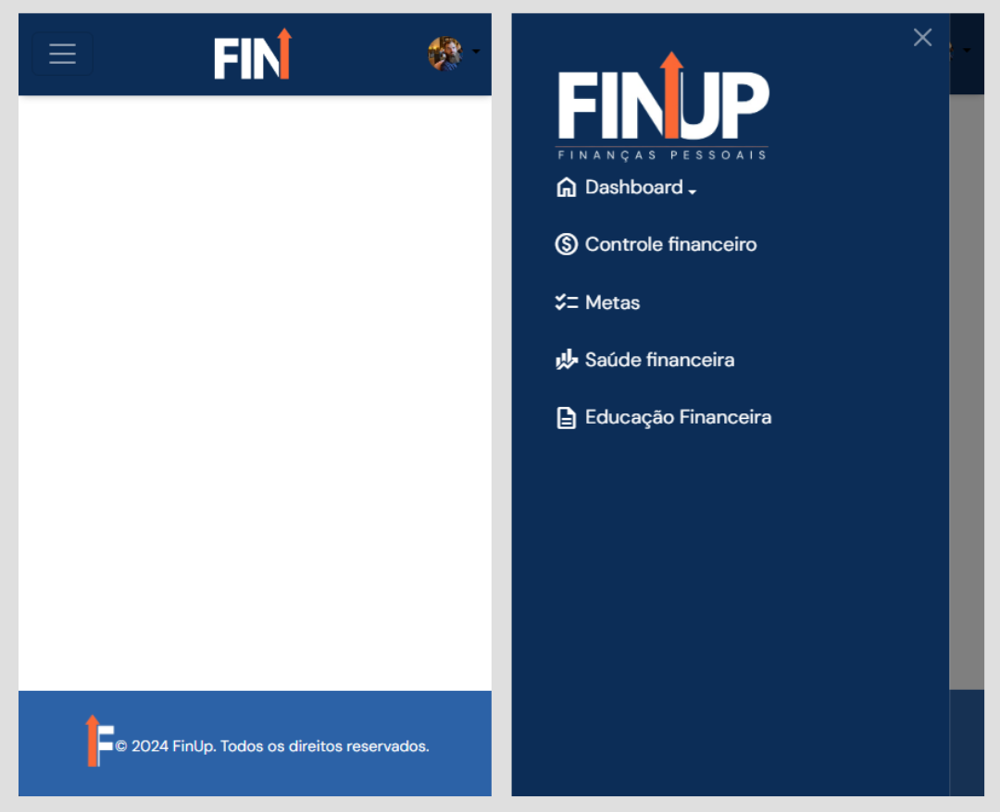

# Template padrão da Aplicação

## Paleta de cores
A Figura 1 exibe as cores que compõem a identidade visual da aplicação e seus contextos de uso. 

<figure>
    
    <figcaption>Figura 1 - Paleta de cores da identidade visual
</figure>

A paleta foi construída por meio dos valores HEX correspondentes e as cores são representadas por propriedades CSS personalizadas para facilitar seu uso, como mostra o trecho de código a seguir:
``` 
:root {
	--azul-escuro-principal: #0c2d57;
	--azul-intermed-secundario: #2c62a7;
	--laranja-principal: #fc6736;
	--amarelo-secundario: #ffad60;
	--azul-claro-suave: #eae5ff;
}
```

## Tipografia
A família de fonte utilizada para apresentação dos elementos textuais é a <i>DM Sans</i>, uma fonte sem serifa e de código aberto. Foi utilizado o código de incorporação disponibilizado pelo Google Fonts para incluí-la na aplicação.

A família genérica das fontes sem serifas é referenciada como <i>fallback</i>, para caso a fonte <i>DM Sans</i> não seja carregada por algum motivo.

A escala tipográfica demonstra a hierarquia textual utilizada com seus respectivos tamanhos tipográficos. A escala utilizada segue o padrão pré-definido pelo framework Bootstrap para tamanho dos elementos textuais. 

A Figura 2 exibe a escala tipográfica em fundo escuro e claro, respectivamente. Além disso, a figura também indica a cor de fundo principal (P) e cores alternativas em contextos específicos (A). 

<figure>
    
    <figcaption>Figura 2 - Escala tipográfica</figcaption>
</figure>


## Logotipo
A Figura 3 apresenta a logotipo em fundo claro e escuro e suas variações, incluindo a logotipo principal e duas versões reduzidas para uso em telas menores, como em dispositivos móveis. 

<figure>
    
    <figcaption>Figura 3 - Logotipo e variações
</figure>

## Iconografia
Foi escolhida a coleção de ícones do Google Fonts para compor a iconografia da aplicação, por ser uma coleção de código aberto e possuir grande variedade de ícones com layout simples. Assim como na fonte, foi utilizado um código de incorporação para uso dos ícones na aplicação.

A Figura 4 apresenta os principais ícones a serem utilizados na aplicação. Entre parênteses está o nome padrão do Google Fonts que pode ser inserido no código HTML para utilizar o ícone.

<figure>
    
    <figcaption>Figura 4 - Iconografia
</figure>

## Estrutura padrão
O template padrão da aplicação é composto pelos seguintes componentes principais: 
* Título: exibe o nome da página;
* Cabeçalho: contém um menu com a foto de perfil de usuário que oferece as opções de ir para as configurações ou fazer o logout.
* Barra de navegação lateral: exibe as opções de navegação para que o usuário navegue facilmente entre as páginas que compõem a aplicação ao clicar nas opções, além de conter a logotipo em sua parte superior;
* Conteúdo: exibe o conteúdo específico da tela;
* Logotipo: exibe o nome e logotipo da aplicação e permite que o usuário retorne à página inicial quando clicado;
* Rodapé: exibe informações a respeito do direito legal de propriedade da aplicação (copyright).

### Elementos de responsividade
A aplicação utiliza recursos do Bootstrap 5 e <i>media queries</i> para fornecer responsividade de acordo com o tamanho da tela. As principais variações de acordo com os respectivos breakpoints são:
* Dispositivos <i>desktop</i> (telas maiores que 992px): a barra lateral permanece expandida e o cabeçalho contém apenas o menu com a foto de perfil do usuário (Figura 5).

<figure>
    
    <figcaption>Figura 5 - Template para dispositivos desktop
</figure>

* Dispositivos <i>mobile</i>, como tablets e smartphones (telas menores que 992px): a barra lateral é automaticamente recolhida, e o cabeçalho passa a exibir, além da foto de perfil, um botão para expandir a barra e a logotipo centralizada (Figura 6). 

<figure>
    
    <figcaption>Figura 6 - Template para dispositivos mobile
</figure>
