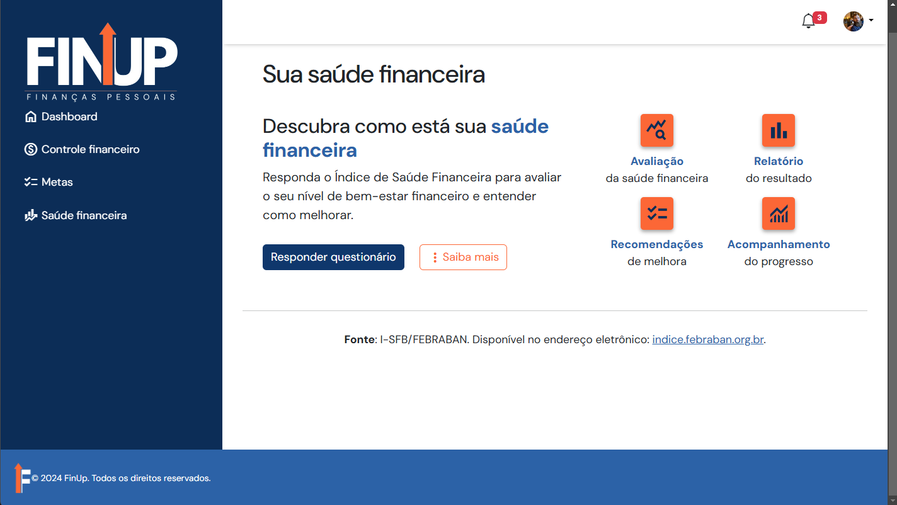

# Programação de Funcionalidades

Pré-requisitos: <a href="01-Documentação de Contexto.md">Documentação de contexto</a>, <a href="02-Especificação do Projeto.md">Especificação do projeto</a>, <a href="03-Metodologia.md">Metodologia</a>, <a href="04-Projeto de Interface.md">Projeto de interface</a> e <a href="05-Template padrão da Aplicação.md">Template padrão da aplicação</a>.

### Tela Homepage (RF-01, RF-02)

Exemplo da Tela Homepage:

#### Requisito atendido

RF-01 - A aplicação deve permitir ao usuário cadastrar uma conta.\
RF-02 - A aplicação deve permitir ao usuário fazer o login da sua conta.

#### Artefatos da funcionalidade

* index.html
* index.css
* index.js

#### Estrutura de Dados

As estruturas de dados foram baseadas em HTML, CSS ee JS

#### Instruções de acesso

1. Abra um navegador de Internet e informe a URL da aplicação.

#### Responsável

João

### Tela de Cadastro (RF-01)

Exemplo da Tela de Cadastro:

#### Requisito atendido

RF-01 - A aplicação deve permitir ao usuário cadastrar uma conta.

#### Artefatos da funcionalidade

* cadastro.html
* style.css
* app.js
* crud.js

#### Estrutura de Dados

As estruturas de dados foram baseadas em HTML, CSS e JS.

#### Instruções de acesso

1. Abra um navegador de Internet e informe a URL da aplicação;
2. Clique no botão "Cadastre-se" no centro esquerdo da página.
3. Insira seus dados.
4. Clique no botão "CRIAR CONTA"

#### Responsável

Rayssa

### Tela de Login (RF-02)

Exemplo da Tela de Login:

#### Requisito atendido

RF-02 - A aplicação deve permitir ao usuário fazer o login da sua conta.

#### Artefatos da funcionalidade

* login.html
* style.css
* app.login.js

#### Estrutura de Dados

As estruturas de dados foram baseadas em HTML, CSS e JS.

#### Instruções de acesso

1. Abra um navegador de Internet e informe a URL da aplicação;
2. Clique no botão "Login" no canto superior direito da página.
3. Insira os dados de login.
4. Clique no botão "login".

#### Responsável

Rayssa

### Tela Questionário I-SFB (RF-03)

Exemplo da Tela Questionário I-SFB:

#### Requisito atendido

RF-03 - A aplicação deve oferecer ao usuário a opção de responder ao Índice de Saúde Financeira do Brasileiro (I-SFB).

#### Artefatos da funcionalidade

* questionario.html
* questionario.css
* questionario.js

#### Estrutura de Dados

As estruturas de dados foram baseadas em HTML, CSS e JS.

#### Instruções de acesso

1. Abra um navegador de Internet e informe a URL da aplicação;
2. Clique no botão "Login" no canto superior direito da página;
3. Insira os dados de login e clique no botão "Login" para finalizar;
4. Clique no item "Saúde Financeira" no menu de navegação da barra lateral esquerda.
5. Clique no botão "Responder questionário" ou "Responder novamente" (caso já exista resposta).

#### Responsável

Isabela

### Tela Resultado do questionário I-SFB (RF-04)

Exemplo da Tela Resultado I-SFB:

#### Requisito atendido

RF-04 - A aplicação deve apresentar ao usuário o resultado do questionário respondido.

#### Artefatos da funcionalidade

* saude-financeira.html
* saude-financeira.css
* saude-financeira.js
* crud-saude-financeira.js

#### Estrutura de Dados

As estruturas de dados foram baseadas em HTML, CSS e JS.

#### Instruções de acesso

1. Abra um navegador de Internet e informe a URL da aplicação;
2. Clique no botão "Login" no canto superior direito da página;
3. Insira os dados de login e clique no botão "Login" para finalizar;
4. Clique no item "Saúde Financeira" no menu de navegação da barra lateral esquerda.
5. Clique no botão "Responder questionário" caso ainda não exista nenhuma resposta.
6. Visualize o resultado.

#### Responsável

Isabela

### Tela Controle Financeiro (RF-05, RF-06)

Exemplo da Tela de Controle Financeiro:

#### Requisito atendido

RF-05 - A aplicação deve permitir ao usuário registrar receitas e despesas e suas respectivas datas.\
RF-06 - A aplicação deve permitir que o usuário categorize as receitas e despesas cadastradas.

#### Artefatos da funcionalidade

* cfinance.html
* cfinance-script.js
* style.css
* cfinance-style.css
* checkbox.js
* finance-CRUD.js
* registros-controle-fin.js
* validação.js

#### Estrutura de Dados

As estruturas de dados foram baseadas em HTML, CSS e JS.

#### Instruções de acesso

1. Abra um navegador de Internet e informe a URL da aplicação;
2. Clique no botão "Login" no canto superior direito da página;
3. Insira os dados de login e clique no botão "Login" para finalizar;
4. Clique no item "Controle Financeiro" no menu de navegação da barra lateral esquerda.

#### Responsável

Júlia

### Tela Dashboard (RF-07)

Exemplo da Tela Dashboard:

#### Requisito atendido

RF-07 - A aplicação deve permitir a visualização, por meio de gráficos e relatórios, das informações cadastradas, de acordo com preferências do usuário.

#### Artefatos da funcionalidade

* dashboard.html
* dashboard.css
* dashboard.js
* crud-dashboard.js

#### Estrutura de Dados

As estruturas de dados foram baseadas em HTML, CSS e JS.

#### Instruções de acesso

1. Abra um navegador de Internet e informe a URL da aplicação;
2. Clique no botão "Login" no canto superior direito da página;
3. Insira os dados de login e clique no botão "Login" para finalizar e acessar a página Dashboard;

#### Responsável

Isabela

### Tela Metas Financeiras (RF-08, RF-09)

Exemplo da Tela Metas Financeiras:

#### Requisito atendido

RF-08 - A aplicação deve permitir ao usuário definir objetivos financeiros.\
RF-09 - A aplicação deve permitir ao usuário visualizar o status de seus objetivos.

#### Artefatos da funcionalidade

* convertMoedas.js
* filtro.js
* metas.html
* script.js
* style_metas.css
* style.css

#### Estrutura de Dados

As estruturas de dados foram baseadas em HTML e CSS.

#### Instruções de acesso

1. Abra um navegador de Internet e informe a seguinte URL: https://github.com/ICEI-PUC-Minas-PMV-ADS/pmv-ads-2024-2-e1-proj-web-t2-pmv-ads-2024-2-e1-finup/blob/develop/codigo-fonte/pagina-homepage/index.html 
2. Clique no botão metas ou, no menu de navegacao no canto superior esquerdo da página;
3. Ao clicar em “metas” no canto superior esquerdo da tela, terá acesso a página de cadastro. 

#### Responsável
Agamenon

### Tela Configurações (RF-10)

Exemplo da tela de Configurações:

#### Requisito atendido

RF-10 - O site deve permitir que o usuário visualize e edite as informações registradas no cadastro na página Conta. Além disso, o usuário deve poder definir preferências para a Página Inicial, Compartilhamentos e Notificações.

#### Artefatos da funcionalidade

* configuracoes.html
* configuracoes.css
* configuracoes.js

#### Estrutura de Dados

As estruturas de dados foram baseadas em HTML, CSS e JS.

#### Instruções de acesso

1. Abra um navegador de Internet e informe a URL da aplicação;
2. Clique no botão "Login" no canto superior direito da página;
3. Insira os dados de login e clique no botão "Entrar" para finalizar;
4. Clique em “Configurações” localizada no menu suspenso no canto superior direito;
5. Clique nos botões “Conta”, “Página Inicial” e “Notificações”.

#### Responsável
Michelle
